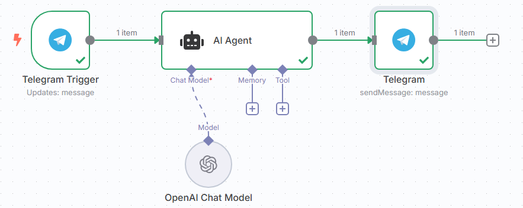

# Target

串接 telegram 和 OpenAI ，讓 Open AI Chat Model 可以回應



# 第一個 node

前置: 拿 telegram access token , 首先登入 telegram 後
```
search: botfather
- `/start`
- `/newbot`
- oursfirstairesponder
- oursfirstairesponder_bot

這樣就拿到 access token
```


`On app event -> Telegram -> On message`
- credential: 放 access token

之後 n8n 左邊點 test step ，去 telegram 丟訊息給 bot ，回去看 n8n 接收的樣子


# 第二個 node

`AI Agent`
- Source for prompt: Define Below
- Prompt: 拉左邊 telegram trigger 的 text: `{{ $json.message.text }}`
- 左下的 Chat Model ，選擇 `OpenAI Chat Model`
  - 這邊單純把 openAI API Key 放上去即可，記得要測試一下，就是執行 execution step
- 點最右邊的 item: 選擇 `telegram -> send a text message`
  - chat ID: 拉左邊的 Telegram trigger 的 id: `{{ $('Telegram Trigger').item.json.message.chat.id }}`
  - text: 拉左邊的 openai 的 output: `{{ $json.output }}`

這樣就完成了
