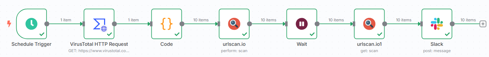

# Intro

自動從 VT 撈釣魚網站 LINK ，丟到 URLScan 上面分析，並傳到 slack 上面



# 第一個 node

`on a schedule`
- 基本不用條，要調也可以，就根據自己想要多久觸發一次，這相當於 crontab

# 第二個 node

`action in an app -> VirusTotal`
- Credential for VirusTotal: 放自己的 VirusTotal API Token
- URL: https://www.virustotal.com/api/v3/intelligence/search (用以做 Threat Intelligence)
- [x] Send Query Parameters
  - Specify Query Parameters: Using Fields Below
  - Query Parameters
    - Name: query
    - Value: (這個就是 vt 搜尋，可以去上面找，這邊複製 vt 上針對釣魚網站的搜尋方式) `entity:url and engines:phishing and p:3+ and fs:2d+`  

點選測試看看有無問題，看看有無拿到資料

# 第三個 node

選 `code`
- mode: Run once for all items
- language: python
- python code below:
```
return _input.first().json.data
```

# 第四個 node

`urlscan.io -> perform a scan`
- Credential: 放自己的 api key
- Resource: Scan
- Operation: Perform
- URL: 這個是直接拉左邊的，選： `{{ $json.attributes.last_final_url }}`  (選 code 裡面找 last_final_url)
- Additional Fields -> Visibility: Public
- 切換上面的 Paramaters -> Docs ---> On Error: Continue

點測試看一下，可以選 table 欄位比較好觀察

# 第五個 node

`flow -> wait`
- Resume: After Time Interval
- Wait Amount: 30
- Wait Unit: Seconds

點一下測試跑看看

# 第六個 node

`urlscan -> get a scan`
- Scan ID: 拉左邊的過來 : `{{ $json.scanId }}`  (來源：wait)
- 出問題就把最上面的 parameters -> settings ，裡面 on error 改為 continue

# 第七個 node

`slack -> send a message`
- Message Type: Blocks
- Blocks: 點選範本(Slack's Block Kit Builder -> Image > no title , 複製改為底下)
```
{
	"blocks": [
		{
			"type": "image",
			"image_url": "{{ $json.task.screenshotURL }}",
			"alt_text": "Phishing Website"
		}
	]
}
```

記得把最上面 Parameters 切到 Settings, On Error: `Continue`

